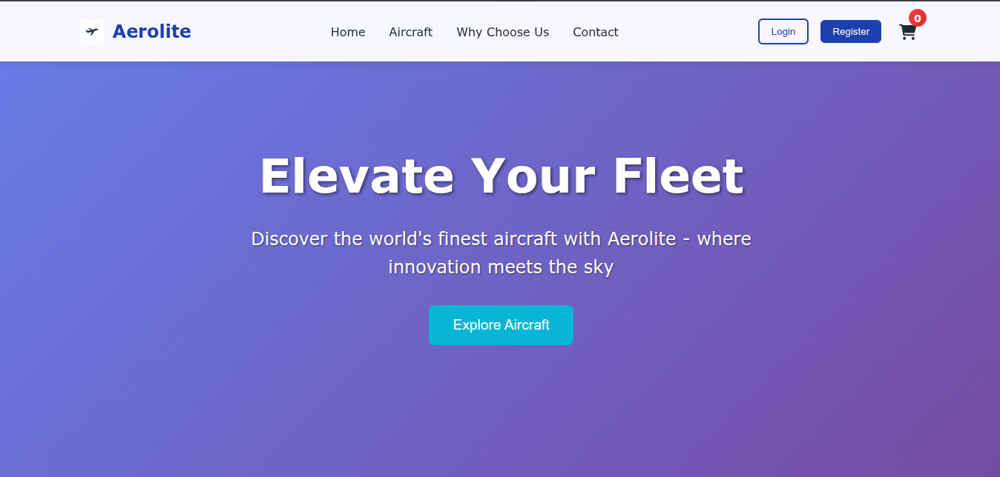
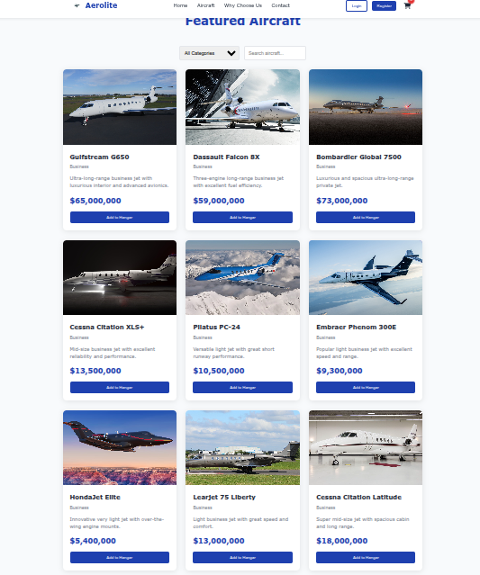
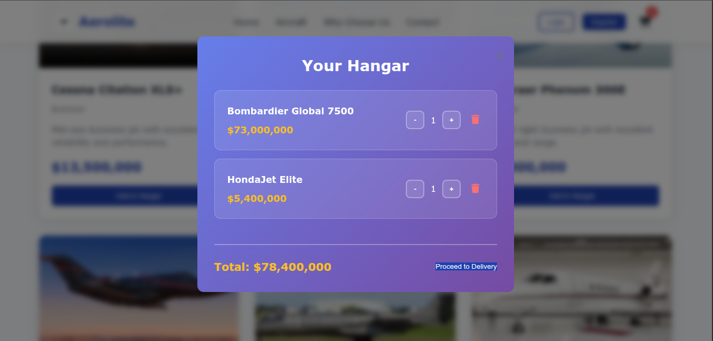
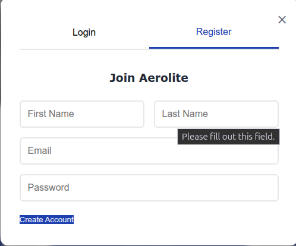

# Aerolite - Premium Aircraft E-commerce Platform

A full-stack e-commerce platform for buying and selling premium aircraft. Built with Flask backend and vanilla JavaScript frontend.

## 🚀 Features

- **User Authentication** - Register, login, and user profiles
- **Product Catalog** - Browse featured aircraft with search and filters
- **Shopping Cart** - Add aircraft to your hangar and manage quantities
- **Order Management** - Complete checkout process with order confirmation
- **Responsive Design** - Beautiful aviation-themed UI that works on all devices

## 🛠️ Tech Stack

### Frontend
- **HTML5** - Semantic markup
- **CSS3** - Custom styling with CSS variables and modern layouts
- **Vanilla JavaScript** - No frameworks, pure JavaScript for all interactions
- **Font Awesome** - Icons for enhanced UI

### Backend
- **Python Flask** - Lightweight web framework
- **SQLite** - Database for development
- **RESTful API** - Clean API design for all operations
- **JWT-like Authentication** - Secure token-based auth system

<<<<<<< HEAD
## 📸 Screenshots

### Homepage


### Aircraft Catalog


### Shopping Cart


### User Authentication


=======
>>>>>>> d8f9c341f1bc6245d1c1d489200e604dca08fc1a
## 🚀 Quick Start

### Prerequisites
- Python 3.8+
- Modern web browser

### Installation

1. **Clone the repository**
```bash
git clone https://github.com/Patel-anshj1022/Mod-6-capstone-project
cd aerolite
```

2. **setup the backend**
```bash
cd backend
python3 -m venv venv
source venv/bin/activate  # On Windows: venv\Scripts\activate
pip install Flask==2.3.3
```

3. **Start the backend server**
```bash
python3 app.py
```
Backend will run on http://localhost:5000

4.**Start the frontend server (in a new terminal)**
```bash
cd frontend
python3 -m http.server 8000
```
Frontend will run on http://localhost:8000


## 🎯 Usage
For Customers
- **Browse Aircraft** - View featured commercial and business aircraft

- **Create Account** - Register with email and password

- **Add to Cart** - Select aircraft for your hangar

- **Checkout** - Complete purchase with delivery information

## 🛡️ Authentication
- The application uses a token-based authentication system:

- Tokens are stored in localStorage

- Automatic token inclusion in authorized requests

- Session persistence across browser refreshes


## 🎨 Design Features
- Aviation Theme - Sky blue color scheme with plane icons

- Responsive Grid - Adapts to mobile, tablet, and desktop

- Modern UI - Glass morphism effects and smooth animations

- User-Friendly - Intuitive navigation and clear call-to-actions

## 🔄 Development
Adding New Features
Backend: Add new routes in app.py

Frontend: Update script.js for new functionality

Styling: Modify style.css for UI changes

## Database Schema
The application automatically creates these tables:

users - User accounts and profiles

products - Aircraft inventory

orders - Customer orders

order_items - Items within each order

## 🚀 Deployment
Backend Deployment (Render/Heroku)
```bash
# Add requirements.txt
echo "Flask==2.3.3" > requirements.txt
echo "python-3.10.0" > runtime.txt

# Deploy to your preferred platform
```
## Frontend Deployment (Netlify/Vercel)
- Upload frontend/ folder contents

- Configure redirects for SPA routing

## 🤝 Contributing
- Fork the repository

- Create a feature branch (git checkout -b feature/amazing-feature)

- Commit your changes (git commit -m 'Add amazing feature')

- Push to the branch (git push origin feature/amazing-feature)

- Open a Pull Request

## 📝 License
- This project is licensed under the MIT License - see the LICENSE file for details.

## 👥 Authors
- Ansh J Patel - Web Developer - [Github](https://github.com/Patel-anshj1022)

## 🙏 Acknowledgments
- Icons by Font Awesome

- Color palette inspired by aviation themes

- Design inspiration from modern e-commerce platforms

## 📞 Support
- If you have any questions or run into issues, please open an issue on GitHub or contact the development team.

<<<<<<< HEAD
### Ready to elevate your fleet? Visit Aerolite today!
=======
### Ready to elevate your fleet? Visit Aerolite today!
>>>>>>> d8f9c341f1bc6245d1c1d489200e604dca08fc1a
