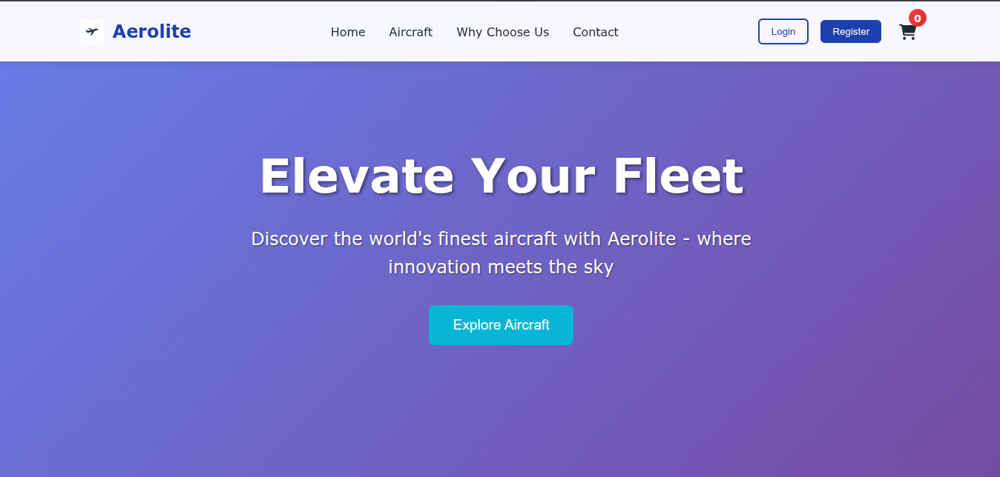
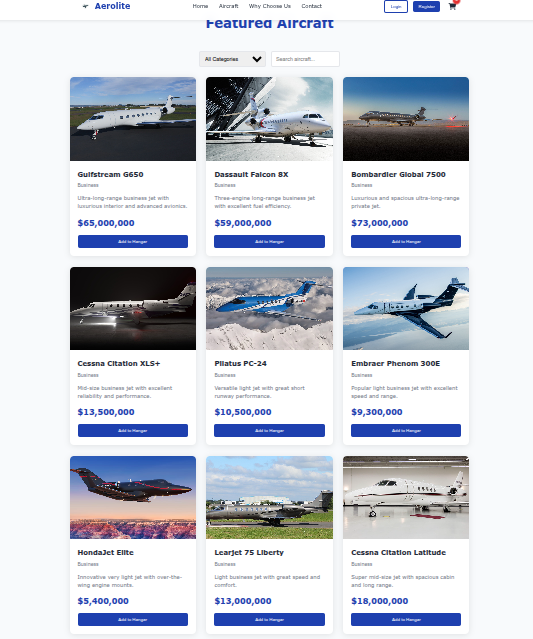
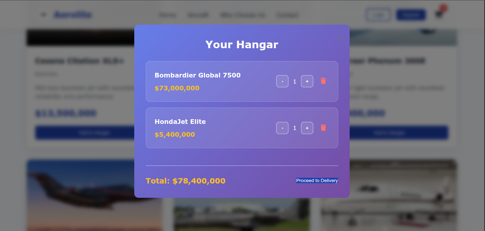
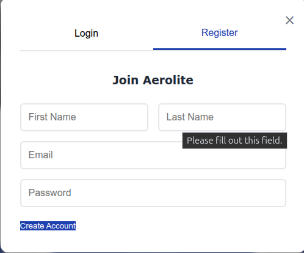

cat > README.md << 'EOF'
# Aerolite - Premium Aircraft E-commerce Platform


A full-stack e-commerce platform for buying and selling premium aircraft. Built with Flask backend and vanilla JavaScript frontend.

## 🚀 Features

- **User Authentication** - Register, login, and user profiles
- **Product Catalog** - Browse featured aircraft with search and filters
- **Shopping Cart** - Add aircraft to your hangar and manage quantities
- **Order Management** - Complete checkout process with order confirmation
- **Responsive Design** - Beautiful aviation-themed UI that works on all devices

## 🛠️ Tech Stack

### Frontend
- **HTML5** - Semantic markup
- **CSS3** - Custom styling with CSS variables and modern layouts
- **Vanilla JavaScript** - No frameworks, pure JavaScript for all interactions
- **Font Awesome** - Icons for enhanced UI

### Backend
- **Python Flask** - Lightweight web framework
- **SQLite** - Database for development
- **RESTful API** - Clean API design for all operations
- **JWT-like Authentication** - Secure token-based auth system

## 📸 Screenshots

### Homepage


### Aircraft Catalog


### Shopping Cart


### User Authentication


## 🚀 Quick Start

### Prerequisites
- Python 3.8+
- Modern web browser

### Installation

1. **Clone the repository**
```bash
git clone https://github.com/yourusername/aerolite.git
cd aerolite